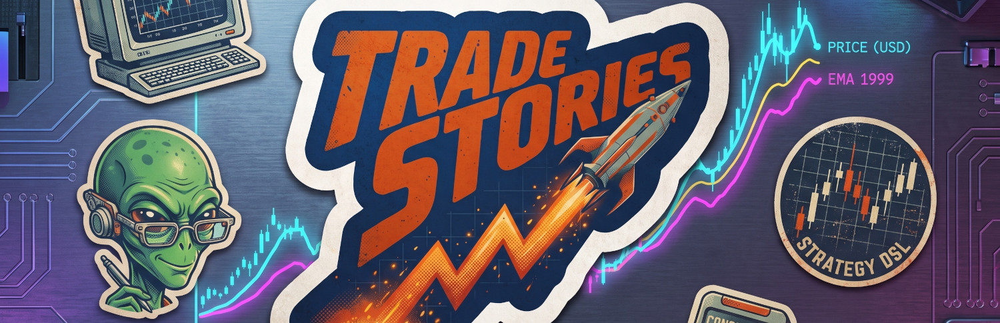

<p align="center">
  
</p>

# Trade Stories DSL

*For help getting started: find me (maff) at the [Save With Crypto trader's Discord](https://savewithcrypto.org/discord).*


***Write your trade setups in a commonly understood format and set of conventions.***

When you have a setup written as a Trade Story, you can:

* let AI agents and other tools verify your setup
* measure the setup's performance through backtesting on real historical data, and live-testing on a live demo account
* fine-tune your setup until it's a fully backtested and consistently profitable trading strategy
* share your setup with others
* ***trade*** your new strategy!


## What is a Trade Story?

A Trade Story is a single trade setup, written to the particular format and set of conventions defined here.

Use the Trade Story format to write your trade setups and turn each one into a consistent, repeatable backtested strategy.

Just so you know what we're going on about, here's an example Trade Story:

```
Story       9 EMA VWAP pullback
Trading     btc/usdt perpetuals on KuCoin, 12m
Sources     9 EMA, VWAP

  Given     price above 9 EMA (uptrend)
  And       VWAP is below the 9 EMA
  When      the price pulls back to the 9 EMA
  Then      BUY
  With      100 usdt margin, 10x leverage
  SL        at the VWAP at entry
            Move SL up to 1% profit once the position is >= 2% in profit
  Until     the price candle closes below the 9 EMA
  Taking    100% - close the position
```

There are also things like invalidation clauses and ways to specify multiple take-profit conditions, risk management etc, but you get the idea. It's a very clear, expressive way of defining, sharing and iterating on your setups.


## Why Write Your Setups As Trade Stories?

It's about:

* Consistency - write each setup with the same basic structure and language
* Thinking about the right things
* Editor support - so your text editor "understands" Trade Stories and can give you syntax colouring, error highlighting and "code completion" hints
* AI support - so AI agents (which also understand Trade Stories) already know how to turn your setups into strategies, verify them, backtest them, offer *meaningful feedback* on them, and of course ***trade*** them

Here's an [introductory article](https://mafftopia.medium.com/trade-stories-4e33fda35b80) that digs further into the "why" of both Trade Stories and writing your trade setups down at all.


## What's Here?

This project repo can be used standalone, or plugged into into another project such as Trade Story System - which will be at `github.com/mafftopia/trade-story-system` when it's ready.

This project contains the following:

* A growing library of trade stories - see the `stories` folder, arranged in subfolders by subject. Your own go in `stories/your-stories`, which is gitignored so they never end up in a commit
* A definition of the Trade Stories *Domain Specific Language (DSL)*, with tool support
* The DSL defined as a "peggy" grammar, so tools and apps can automatically check your stories for you

This trade-stories repo doubles as a standalone set of AI agent skills AND a skills plugin. So if you want, you can install trade-stories into your own local project with (in Claude Code):

```
/plugin marketplace add mafftopia/trade-stories
```


## Getting Started - Traders

**Important to emphasise:** you don't have to understand or know about *most* of what's here. The majority of files and folders in this repo provide tooling support.

If you're reading this page on Github, the best way to get started is to download this repo directly:

1. Install ["git"](https://git-scm.com/) if you don't already have it
2. Open a terminal (command-line) and paste in:
     `git clone https://github.com/mafftopia/trade-stories.git`

Then - additional stuff, if you want it:

1. To use the bundled scripts (which your AI assistant will want to use), [install Node.js](https://nodejs.org/en/download).
2. If you want to use an AI assistant, install [Claude Code](https://claude.com/product/claude-code) - or if you'd prefer to use it within the [Claude desktop app](https://claude.com/product/overview), just install that; then click on the Code tab.

And a quick reminder - if you're totally stuck, or want to ask questions, provide feedback, discuss trade setups etc, find us on Discord at [Save With Crypto](https://savewithcrypto.org/discord).


## Next Steps - Traders

Get to know the Trade Stories DSL a little bit. You don't have to memorise everything, but a little knowledge of it will help.

### A little bit about the Trade Stories DSL

Each line of a story is a **clause**. It begins with a **keyword**, followed by a **predicate**:

```
  When   the 21 EMA crosses above the 55 EMA
```

Think of the keyword (**When**) as a question bundled into a single word; the predicate is your answer, written in free text - i.e. write whatever you want to answer the question.

**When** is asking: What triggers entry?

Answer each question one by one, and at the end you've got your trade setup totally defined. (Of course, you'll iterate on it, fill in details etc).

The [keywords](./dsl/keywords.md) file lists each of the recognised keywords.

Here's a [more in-depth explanation of each keyword](https://mafftopia.com/trade-stories-dsl/) along with other aspects of the DSL.


### Using what's here

Most of the files under `dsl` and elsewhere are instructions to AI assistants (agents); and tbh you'll find that using just such an AI assistant is how you'll get the best results from Trade Stories.

Assuming you're using the Claude desktop app and/or Claude Code (which this repo is all set up for):

In a terminal, navigate to this folder, then type:

```
claude
```

Or in the desktop app, click on the Code tab, and tell it to use this folder. (The folder selection is just above where you type your prompts - although they do change things around; who knows where it'll be next week!).

Type `/write-story`

(When you type / and start to type, a list of matching commands, AKA skills, will pop up; press Tab on the one you want, to save typing the whole thing).

You can either press Enter, or type a name for your new trade setup - OR, in fact, start to describe it. Put in as much or as little detail as you want.

Claude will then proceed to ask you questions, to either get clarification or fill in any gaps in the details. Once it has everything it needs, it'll write your trade story and put in `stories/your-stories`.

Other Claude commands/skills available here:

`verify-story` - check your story for "showstopper" errors which would prevent it from being turned into a trading strategy.

`lint-story` - check your story for minor issues (warnings, rather than errors) such as ambiguity.

If you want to go further and have Claude turn your story into a TradingView strategy, run it, backtest it on historical data, analyse the results with you, and automatically trade the strategy, install [Trade Story System](https://github.com/mafftopia/trade-story-system) - which uses trade-stories as a Claude Code plug-in.


## Getting Started - Developers and AI Agents

Some Claude Code skills are defined here - for writing, verifying and linting stories.

There's also a Claude Code plug-in wrapper, which simply points at the skills and agents defined in .claude. This allows you to bring the Trade Stories DSL directly into your own project - or into a project that already uses it, for example [Trade Story System](https://github.com/mafftopia/trade-story-system).

